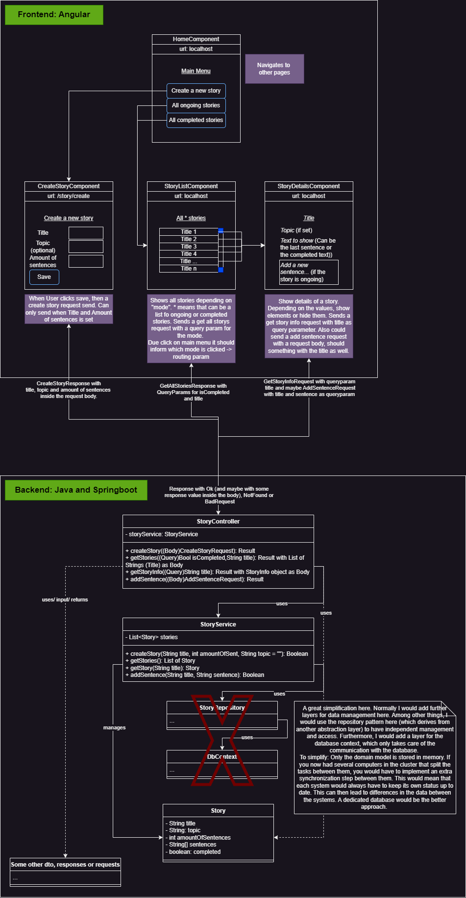

# My steps documented
This document is intended to summarize the steps I took to complete the task. 

## Overview the tasks
First, I read through all the user stories carefully. Then I got my ideas down on paper, transferred these to draw.io and expanded them.

In the overview (picture below) you can see:

A division between backend and frontend. For the frontend the web framework Angular is used. All necessary web pages are displayed and related in this section. Furthermore, a rough overview of the communication with the backend is given here. The graphic shows that the web page component addresses the api. This is the simplified view. Normally there would be an ApiService layer in between, which addresses the API. On the other side is the backend with the Springboot framework. Simplified, you can see a UML diagram that should reflect the rough class relationships. It should be noted that the diagram itself shows a strong simplification. The simplification is explained and the "better" way is shown. Overall, the “block” for the backend can be seen as a domain.



### "Reaching into the future"
*This section is added at the end. I'll note here why I usually get an overview before I start working on real code.*

Creating an overview gave me the following benefits during development:
- The first point is obvious: it gave me an overview. What roughly needs to exist to answer / solve the question / problem.
- Initial and further thoughts are recorded, so there is no need to rethink the task and basic structure if necessary.
- A rough basic structure: Because I had an overview, I was able to divide larger tasks into several smaller ones.
- Implementation is faster because there is a common thread, tasks can be worked through one after the other

Of course, it takes small amount of time, but I think it's always a good investment for the future, because it saves a lot of time for later projects.
## Implementing the API

### Story #1: Make it possible to create a story on backend side

I want to provide an API post method to give the user the ability to create a new story. For that story some parameters like title, topic and amount of sentences is needed.

- Create the domain model `Story` and its implementation
- Create the `StoryController` and `StoryService`
- Create the functionality for creating a new story
    - The `StoryController` gets as input an object
    - Create `CreateStoryResponse` object
    - Save `Story`s in memory inside `StoryService` as a list (Simplification #1)

Simplifications:
- #1: Saving the domain models in memory
- #2: Unit-Testing only a small fraction

When the user sends a `CreateStoryRequest`, it is checked in the `StoryService` and if the check is positive, a domain model is created and saved. Tested with postman post request at `localhost:8080/api/stories`. Configure request as JSON format. And as request body example:
```json
{
    "title": "A random chess story",
    "topic": "Chess",
    "amountOfSentences": 5
}
``` 

### Story #2: Make it possible to get all ongoing and completed stories

I want to provide an API get method with an optional query param isCompleted. Depending on the param, the query will return all running or completed story titles. The user should then be able to request specific information about the story by providing the title of the story as a query param.  

- Create new get method for `StoryController` to get ongoing, completed or all stories.
- Extend `StoryService` to get ongoing, completed or all stories
- Also added new get method for `StoryController` to get information about a story. User must provide an existing story title
- Create new response model `GetStoryInfoResponse`


Simplifications:
- #3: No unit testing

Apis:
- `localhost:8080/api/stories`
- `localhost:8080/api/stories?isCompleted=false`
- `localhost:8080\api\stories\A chess random story`

### Story #3: Make it possible to update ongoing stories via adding sentence to it

I want to provide an API put method to update an existing ongoing story. The user send with title as path variable and the sentence to add as request param (Simplification #4).

- Create new put method for `StoryController` to add a sentence to a ongoing story. The same method gives back the an new info about the story
- Refactor: Renamed `GetStoryInfoResponse` -> `StoryInfoResponse`, because 'add sentence' method gives back the same object
- Added new fuctionality to `StoryService` to add a sentence to the story


Simplifications:
- #4: Better would be request body to scale it later on

Apis:
- `localhost:8080/api/stories/new-sentence-{title}?sentence={sentence}`

### Concluding words

For the backend side, no further action is required at this time, as Stories #4 and #5 are only needed for the interface. I started writing the user stories on the backend side, as the interface itself can be implemented abstractly. In the first commit I already added the cors configuration needed for the angular application on localhost.

All commits are tagged by user story number. Normally, I would not commit and push them directly into main, but keep them in a separate branch and merge them into the production branch after the task has been completed (e.g. with a final review). 

## Implementing the Web App

As I have already completed the backend side and worked my way through the user stories, the initial project structure can be implemented smoothly.

- Adding Bootstrap to the index.html file
- A `HomeComponent` is required. This means that the home component is defined as the `HomeComponent`, which navigates to other components.
- All necessary components  `Home`, `StoryList`, `StoryDetails` and `CreateStoryComponent` already created
- Navigation from `HomeComponent` to create new story and story listen wired together
- Added environment files, because the interface to be addressed does not change. Here is a simplification #5


Simplifications:
- #5: Using an unsecure connection `http://localhost:8080`

### Story #1: As a player, I want to create a new story

The project setup has already created a `HomeComponent` that allows you to navigate to different pages. So only the New Story component had to be adapted. The following has been added or changed in this user story

- Added the http provider to the app config
- created a `StoryService` that calls the create new story api from the backend
- The Create New Story UI component is created as a form and can only be submitted if all the required fields have been filled in correctly.

### Story #2: As a player, I want to see all ongoing and completed stories
This task is quick and easy to complete as only the stories are queried and can be displayed as list buttons.

- Fill `StoryListComponent`
- Extend `StoryService` to get all stories with completed query param
- Navigate to `StoryDetailsComponent`


### Story #3: As a player, I want to add a sentence to the story
Also a simple extension of the web page. Show the topic element on the page if it is set and the input field element only when the story is not completed yet.

- Added `Story` model to features
- Extend `StoryService` to send put request to add sentence to story
- Filled `StoryDetailsComponent` 

### Story #4 and #5: Words to the other stories
These stories are already finished. Story #4 is finished because the `StoryDetailsComponent` and `Story` are already abstract. The elements are therefore displayed according to the parameters. In this case the story is already finished because `Story` has a `textToShow` property. This is already assembled correctly in the backend and shows either the last added sentence or the complete text. Here it is the complete text that is transmitted.
User Story #5 has already been completed by Story #2 and can be navigated from the `HomeComponent`, which is the main menu.

## To summarise
Overall, this project is kept simple, but still scalable. Layers were deliberately omitted, as explained in the overview. However, the Springboot web framework allows new API controllers to be implemented quickly. It can also be further scaled by adding additional services and domains. DI (Dependency Injection) makes it easy to access additional domains and their services, which can open up new possibilities. At some point, of course, a limit is reached. You could imagine many domains performing heavy computing operations on each other while many users make requests. Here you would need to scale up and possibly set up some sort of cluster between the systems, which could then be synchronised by a dedicated database and accessed via a message queue. In short. 

I chose the Bootstrap framework for Angular because it allows me to quickly and easily create modern and clean element layouts using Bootstrap CSS classes. Furthermore, the Angular framework and other plugins offer many possibilities to further scale and customise the website.

## What could happen next? Coming user stories

### Story #6: As a player, I cannot add a sentence if the last sentence has already been set by me
This user story has a large changeset coming up, which should be well thought out. In this task, you need to think about how to track contributions. This is followed by many smaller subtasks such as
- add a new domain `User`
- add identification (which could be simple at first, like logging in with just the usernames)
- only authorised users can view and contribute to stories
- create a relationship between users and added sentences to stories by extend the sentences property of `Story`
- as soon as a user would enter sensitive data (e.g. email, password), the unencrypted approach should also be reconsidered
- a login page must be implemented
- The authorisation token that comes from the login response needs to be stored.
- Find an approach to storing data, such as local storage.
- prevent unauthorised users from accessing story pages, e.g. as interceptors

### Story #7: As a player, I want to see all the games in which I have contributed a sentence

Depending on if user story #6 is implemented, then the relationship between users and added sentences to stories is already added. The further tasks would be to extend the `StoryController` to return this data via get method. 

### Story #8: As a player, I would like to be notified when a story is completed

This story creates entirely new tasks. Things like:
- Give the user the ability to mark up / subscribe to any story he wants
- Then there should be a user and auth handling like in story #6
- Create a relationship between the user and these marked stories
- Extend `StoryService` to return the marked stories to the user via a get method

It is possible to create other tasks here. One that still needs to be mentioned is the actual notification. How (email, push, etc.) does the user want to be notified? The Observer pattern could answer this question from an architectural point of view.

## Conclusion
